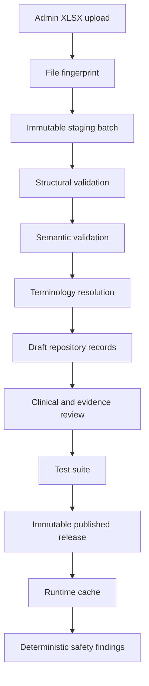

# SafeScribe Clinical Safety Repository

## 12-File Developer Implementation and Integration Guide

**Version:** 1.0  
**Audience:** SafeScribe developer working in Cursor  
**Target stack:** Supabase/PostgreSQL, TypeScript, existing SafeScribe Admin Portal and terminology integration  
**Clinical status:** The workbook content is sample/draft content. It is suitable for schema, import, workflow and engine testing only. It must not become production-active without terminology resolution and clinical approval.

---

## 1. The outcome to build

Build a governed clinical repository that can:

1. accept any of the 12 approved `.xlsx` templates through the Admin Portal;
2. identify the file type from its exact header contract;
3. validate every row without partially changing live data;
4. resolve medication and condition selectors through CCDD/SNOMED CT/ATC/DPD;
5. store valid records as drafts in PostgreSQL;
6. show row-level errors and warnings to the administrator;
7. support clinical review, evidence review, approval and versioned publication;
8. publish an immutable repository release;
9. evaluate only the published release in the live safety engine;
10. run the supplied test cases before publication;
11. preserve a complete audit trail;
12. reconstruct exactly which repository and terminology versions produced any clinical finding.

The most important architectural rule is:

> Upload is not publication. A successfully imported spreadsheet creates or updates draft repository content only.

The second rule is:

> CCDD/SNOMED/ATC identify what a medication or condition is. SafeScribe's published rules determine what clinical action should occur.

The third rule is:

> The LLM must not decide whether a safety rule matches. Runtime safety evaluation must remain deterministic and continue to work when the LLM is unavailable.

---

## 2. The 12 files and their jobs

| # | File type key | Workbook responsibility | Production runtime role |
|---:|---|---|---|
| 1 | `allergy_cross_reactivity_rules` | Clinically approved cross-reactivity relationships | Direct rule matching |
| 2 | `drug_interactions` | Drug-drug interaction decisions | Direct rule matching |
| 3 | `drug_disease_rules` | Medication-condition restrictions | Direct rule matching |
| 4 | `renal_rules` | Renal metric bands, dose/action rules and dialysis cases | Direct rule matching |
| 5 | `lab_threshold_rules` | Lab threshold, recency, unit and missing-result rules | Direct rule matching |
| 6 | `pregnancy_rules` | Gestational-age, route and indication-specific pregnancy rules | Direct rule matching |
| 7 | `lactation_rules` | Infant, feeding and maternal-context lactation rules | Direct rule matching |
| 8 | `clinical_value_sets` | Definitions and versions of governed medication groups | Runtime dependency |
| 9 | `clinical_value_set_members` | Included and excluded coded members of each value set | Runtime dependency |
| 10 | `rule_evidence` | Sources, exact locators, appraisal and review dates | Governance dependency; not interpreted at runtime |
| 11 | `test_cases` | Expected result for each safety scenario | Test/publish gate only |
| 12 | `test_inputs` | Atomic scenario inputs grouped into bundles | Test/publish gate only |

Do not rebuild these as manual production spreadsheets:

- drug catalogue;
- product-to-ingredient mapping;
- general medication class hierarchy.

Those must be terminology-managed datasets synchronized from CCDD/SNOMED CT, supplemented by Health Canada DPD/DIN for Canadian marketed-product information and ATC for classification candidates.

Direct ingredient allergy is also engine logic, not a large authored rule sheet:

```text
recorded allergy concept
  -> normalize to ingredient
selected medication concept
  -> decompose to active ingredients
ingredient intersection
  -> direct allergy finding
```

File 1 is for cross-reactivity only.

---

## 3. Current file-readiness note

Nine final workbooks were available for direct schema inspection when this guide was written. The current workspace did not contain the final files for:

- `renal-rules` (previously created as 46 columns and 10 draft sample rules);
- `lab-threshold-rules` (previously created as 49 columns and 11 draft sample rules);
- `pregnancy-rules` (previously created as 46 columns and 11 draft sample rules).

Do not guess or silently recreate their headers in production code. Before the final end-to-end import test, recover or reattach those three final `.xlsx` files, register their exact header arrays, and add schema fixtures for them. Their logical mappings and engine requirements are included below.

---

## 4. Recommended architecture



### 4.1 Separation of concerns

Use these modules:

```text
src/
  clinical-repository/
    contracts/
      workbook-registry.ts
      controlled-values.ts
      schemas/
    import/
      parse-xlsx.ts
      fingerprint-workbook.ts
      validate-structure.ts
      validate-row.ts
      validate-cross-file.ts
      resolve-terminology.ts
      promote-drafts.ts
    governance/
      review-service.ts
      publication-service.ts
      release-validator.ts
    runtime/
      load-release.ts
      normalize-clinical-input.ts
      selector-matcher.ts
      evaluators/
      consolidate-findings.ts
    tests/
      repository-test-runner.ts
  app/api/admin/clinical-repository/
  app/admin/clinical-repository/
supabase/
  migrations/
```

Adjust paths to the existing repository rather than creating a parallel architecture.

### 4.2 Never evaluate directly from Excel

Excel is an authoring and transfer format. The live engine must never open an `.xlsx` file. The runtime sequence is:

```text
XLSX -> validation -> draft SQL records -> approval -> release snapshot -> runtime cache
```

---

## 5. PostgreSQL data model

Use UUID primary keys internally. Preserve workbook identifiers as stable business keys. Do not use display names as match keys.

### 5.1 Core enums

Prefer lookup tables if the existing project avoids PostgreSQL enums. If enums are acceptable, begin with:

```sql
create type clinical_content_status as enum (
  'DRAFT',
  'PENDING_REVIEW',
  'APPROVED',
  'PUBLISHED',
  'RETIRED'
);

create type clinical_approval_status as enum (
  'NOT_REVIEWED',
  'PENDING_REVIEW',
  'APPROVED',
  'REJECTED'
);

create type import_batch_status as enum (
  'UPLOADED',
  'PARSING',
  'VALIDATING',
  'REQUIRES_CORRECTION',
  'READY_TO_IMPORT',
  'IMPORTED',
  'FAILED',
  'CANCELLED'
);

create type import_row_status as enum (
  'PENDING',
  'VALID',
  'WARNING',
  'ERROR',
  'IMPORTED',
  'SKIPPED'
);
```

Do not hard-code clinical severities and actions independently in several frontend components. Put their canonical definitions in one server-side controlled-value registry and expose them to the Admin UI.

### 5.2 Repository releases

```sql
create table clinical_repository_releases (
  id uuid primary key default gen_random_uuid(),
  release_code text not null unique,
  jurisdiction text not null,
  version text not null,
  status clinical_content_status not null default 'DRAFT',
  terminology_release text,
  previous_release_id uuid references clinical_repository_releases(id),
  release_notes text,
  created_at timestamptz not null default now(),
  created_by uuid not null references auth.users(id),
  approved_at timestamptz,
  approved_by uuid references auth.users(id),
  published_at timestamptz,
  published_by uuid references auth.users(id),
  retired_at timestamptz,
  constraint uq_repository_release unique (jurisdiction, version)
);

create unique index uq_one_published_repository_per_jurisdiction
on clinical_repository_releases(jurisdiction)
where status = 'PUBLISHED';
```

If you need a historical published release while a new one becomes current, replace the partial index with a separate `is_current` boolean and enforce one current release per jurisdiction. Never rewrite the old release.

### 5.3 Import batches and immutable row staging

```sql
create table clinical_import_batches (
  id uuid primary key default gen_random_uuid(),
  tenant_id uuid,
  file_type_key text,
  original_filename text not null,
  storage_path text not null,
  sha256 text not null,
  workbook_sheet_name text,
  header_fingerprint text,
  schema_version text,
  status import_batch_status not null default 'UPLOADED',
  total_rows integer not null default 0,
  valid_rows integer not null default 0,
  warning_rows integer not null default 0,
  error_rows integer not null default 0,
  target_release_id uuid references clinical_repository_releases(id),
  uploaded_at timestamptz not null default now(),
  uploaded_by uuid not null references auth.users(id),
  imported_at timestamptz,
  imported_by uuid references auth.users(id),
  failure_summary text,
  unique (sha256, target_release_id)
);

create table clinical_import_rows (
  id uuid primary key default gen_random_uuid(),
  import_batch_id uuid not null references clinical_import_batches(id) on delete restrict,
  source_row_number integer not null,
  business_key text,
  raw_payload jsonb not null,
  normalized_payload jsonb,
  row_status import_row_status not null default 'PENDING',
  errors jsonb not null default '[]'::jsonb,
  warnings jsonb not null default '[]'::jsonb,
  promoted_record_type text,
  promoted_record_id uuid,
  created_at timestamptz not null default now(),
  unique (import_batch_id, source_row_number)
);
```

Keep `raw_payload` exactly as uploaded. Never overwrite it after validation. Corrections require a new upload batch.

### 5.4 Common clinical rule envelope

The seven live rule workbooks share a common lifecycle but have different conditions. Use a common envelope plus a JSONB payload validated against a domain-specific JSON Schema. This avoids a fragile 250-column universal table while retaining strong validation.

```sql
create table clinical_rules (
  id uuid primary key default gen_random_uuid(),
  release_id uuid not null references clinical_repository_releases(id) on delete restrict,
  domain text not null check (domain in (
    'ALLERGY_CROSS_REACTIVITY',
    'DRUG_INTERACTION',
    'DRUG_DISEASE',
    'RENAL',
    'LAB_THRESHOLD',
    'PREGNANCY',
    'LACTATION'
  )),
  rule_code text not null,
  rule_version text not null,
  jurisdiction text not null,
  source_row_key text not null,
  import_batch_id uuid not null references clinical_import_batches(id),
  import_row_id uuid not null references clinical_import_rows(id),
  rule_effect text not null,
  alert_severity text not null,
  recommended_action_code text not null,
  alert_summary text not null,
  alert_detail text,
  override_allowed boolean not null default false,
  override_reason_required boolean not null default false,
  acknowledgement_required boolean not null default false,
  deduplication_group text,
  specificity_rank integer not null default 0,
  payload jsonb not null,
  content_status clinical_content_status not null default 'DRAFT',
  approval_status clinical_approval_status not null default 'NOT_REVIEWED',
  effective_start_date date,
  effective_end_date date,
  created_at timestamptz not null default now(),
  created_by uuid not null references auth.users(id),
  reviewed_at timestamptz,
  reviewed_by uuid references auth.users(id),
  published_at timestamptz,
  unique (release_id, domain, rule_code, rule_version),
  constraint chk_override_reason
    check (not override_reason_required or override_allowed),
  constraint chk_published_effective_date
    check (content_status <> 'PUBLISHED' or effective_start_date is not null)
);

create index idx_clinical_rules_runtime
  on clinical_rules(release_id, domain, content_status);
create index idx_clinical_rules_payload_gin
  on clinical_rules using gin(payload jsonb_path_ops);
```

At import, map workbook-specific columns into `payload`, but also map the common alert/lifecycle columns into typed columns. Validate payloads with application JSON Schema before insert. For extra database protection, add domain-specific SQL checks or stored validation functions once the schemas stabilize.

### 5.5 Medication and clinical selectors

Do not compare free-text drug names. Normalize all selectors into this shape:

```ts
export type ClinicalSelector = {
  selectorType: 'INGREDIENT_SELECTOR' | 'PRODUCT_SELECTOR' | 'VALUE_SET';
  selectorCode: string;
  selectorVersion: string | null;
  terminologySystem: string | null;
  resolvedConceptIds: string[];
  routeScope?: string | null;
  doseFormScope?: string | null;
};
```

You may persist selectors in JSONB inside each rule payload for the MVP. If lookup volume grows, add a materialized `clinical_rule_selectors` table:

```sql
create table clinical_rule_selectors (
  id uuid primary key default gen_random_uuid(),
  rule_id uuid not null references clinical_rules(id) on delete cascade,
  selector_role text not null,
  selector_type text not null,
  selector_code text not null,
  selector_version text,
  route_scope text,
  dose_form_scope text,
  resolved_concept_ids text[] not null default '{}',
  terminology_release text,
  resolution_status text not null,
  unique (rule_id, selector_role)
);

create index idx_rule_selector_concepts
  on clinical_rule_selectors using gin(resolved_concept_ids);
```

### 5.6 Clinical value sets

```sql
create table clinical_value_sets (
  id uuid primary key default gen_random_uuid(),
  release_id uuid not null references clinical_repository_releases(id),
  value_set_code text not null,
  value_set_version text not null,
  display_name text not null,
  description text,
  clinical_domain text not null,
  intended_use text not null,
  member_concept_type text not null,
  terminology_basis text,
  candidate_generation_method text,
  membership_mode text not null,
  route_scope text,
  dose_form_scope text,
  inclusion_definition text not null,
  exclusion_definition text,
  clinical_steward text,
  review_frequency_months integer,
  terminology_release_snapshot text,
  record_status clinical_content_status not null default 'DRAFT',
  approval_status clinical_approval_status not null default 'NOT_REVIEWED',
  effective_from date,
  effective_to date,
  import_batch_id uuid not null references clinical_import_batches(id),
  source_row_id text not null,
  unique (release_id, value_set_code, value_set_version)
);

create table clinical_value_set_members (
  id uuid primary key default gen_random_uuid(),
  value_set_id uuid not null references clinical_value_sets(id) on delete restrict,
  member_sequence integer not null,
  membership_action text not null check (membership_action in ('INCLUDE', 'EXCLUDE')),
  member_selector_type text not null,
  member_local_code text,
  member_display_name text not null,
  concept_domain text not null,
  terminology_system text,
  terminology_concept_code text,
  terminology_display_name text,
  terminology_version text,
  route_scope text,
  dose_form_scope text,
  candidate_source text,
  candidate_query_reference text,
  mapping_method text,
  mapping_confidence text,
  clinical_rationale text,
  clinical_review_status text not null,
  record_status clinical_content_status not null default 'DRAFT',
  effective_from date,
  effective_to date,
  import_batch_id uuid not null references clinical_import_batches(id),
  source_row_id text not null,
  unique (value_set_id, member_sequence)
);

create unique index uq_value_set_resolved_member
on clinical_value_set_members(
  value_set_id,
  terminology_system,
  terminology_concept_code,
  coalesce(route_scope, ''),
  coalesce(dose_form_scope, ''),
  membership_action
)
where terminology_concept_code is not null;
```

Runtime membership logic is:

```text
included = concept matches any published INCLUDE row
excluded = concept matches any published EXCLUDE row
member = included AND NOT excluded
```

An exclusion must win over a broad inclusion. Do not regenerate a published membership version in place after a terminology update. Create and review a new value-set version.

### 5.7 Rule evidence

```sql
create table clinical_rule_evidence (
  id uuid primary key default gen_random_uuid(),
  release_id uuid not null references clinical_repository_releases(id),
  evidence_link_id text not null,
  rule_code text not null,
  rule_version text not null,
  clinical_domain text not null,
  evidence_role text not null,
  source_type text not null,
  source_title text not null,
  source_organization text not null,
  source_jurisdiction text,
  source_identifier text,
  source_version_or_date text,
  source_url text,
  source_locator text,
  evidence_summary text not null,
  applicability_to_rule text,
  limitations_or_uncertainty text,
  evidence_quality text,
  recommendation_strength text,
  supports_rule_outcome text,
  source_status text not null,
  record_status clinical_content_status not null default 'DRAFT',
  approval_status clinical_approval_status not null default 'NOT_REVIEWED',
  clinical_reviewer text,
  clinical_review_date date,
  next_review_due date,
  effective_from date,
  effective_to date,
  import_batch_id uuid not null references clinical_import_batches(id),
  unique (release_id, evidence_link_id)
);
```

Publication must fail when an evidence record needed by a rule has an unresolved source, missing exact locator where required, or non-approved status.

### 5.8 Test cases and inputs

```sql
create table clinical_repository_test_cases (
  id uuid primary key default gen_random_uuid(),
  release_id uuid not null references clinical_repository_releases(id),
  test_case_id text not null,
  suite_version text not null,
  test_case_name text not null,
  safety_domain text not null,
  test_type text not null,
  priority text not null,
  jurisdiction text not null,
  scenario_summary text not null,
  rule_code_under_test text,
  rule_version_under_test text,
  input_bundle_key text not null,
  required_repository_release text,
  required_terminology_release text,
  expected_raw_match_count integer not null,
  expected_primary_rule_code text,
  expected_rule_effect text,
  expected_alert_severity text,
  expected_action_code text,
  expected_deduplicated_finding_count integer not null,
  expected_no_match_reason text,
  pass_criteria text not null,
  execution_mode text not null,
  content_status clinical_content_status not null default 'DRAFT',
  implementation_notes text,
  import_batch_id uuid not null references clinical_import_batches(id),
  unique (release_id, test_case_id, suite_version)
);

create table clinical_repository_test_inputs (
  id uuid primary key default gen_random_uuid(),
  release_id uuid not null references clinical_repository_releases(id),
  record_id text not null,
  input_bundle_key text not null,
  input_sequence integer not null,
  input_type text not null,
  entity_role text not null,
  payload jsonb not null,
  terminology_release text,
  resolution_status text not null,
  content_status clinical_content_status not null default 'DRAFT',
  implementation_notes text,
  import_batch_id uuid not null references clinical_import_batches(id),
  unique (release_id, record_id),
  unique (release_id, input_bundle_key, input_sequence)
);

create index idx_test_inputs_bundle
  on clinical_repository_test_inputs(release_id, input_bundle_key, input_sequence);
```

The test tables must never be joined into production patient evaluation. The test runner builds an in-memory `ClinicalSafetyContext` from each bundle and calls the same evaluator used by production.

### 5.9 Audit log

Use the existing SafeScribe audit table if one already exists. Otherwise:

```sql
create table clinical_repository_audit_log (
  id bigint generated always as identity primary key,
  actor_user_id uuid references auth.users(id),
  action text not null,
  entity_type text not null,
  entity_id text not null,
  release_id uuid references clinical_repository_releases(id),
  import_batch_id uuid references clinical_import_batches(id),
  before_state jsonb,
  after_state jsonb,
  reason text,
  request_id text,
  created_at timestamptz not null default now()
);

revoke update, delete on clinical_repository_audit_log from authenticated;
```

Write audit events for upload, validation, import, terminology mapping, review, rejection, approval, publication, retirement, override and failed publication.

---

## 6. Workbook registry: the import contract

Create one registry. Do not scatter header arrays through endpoint code.

```ts
export type WorkbookDefinition = {
  typeKey: string;
  schemaVersion: string;
  expectedSheetCount: 1;
  acceptedSheetNames: string[];
  exactHeaders: readonly string[];
  businessKeyColumns: readonly string[];
  rowSchema: unknown;
  promote: (row: unknown, ctx: ImportContext) => Promise<PromotionResult>;
};

export const WORKBOOK_REGISTRY: Record<string, WorkbookDefinition> = {
  allergy_cross_reactivity_rules: allergyCrossReactivityDefinition,
  drug_interactions: drugInteractionsDefinition,
  drug_disease_rules: drugDiseaseDefinition,
  renal_rules: renalRulesDefinition,
  lab_threshold_rules: labThresholdRulesDefinition,
  pregnancy_rules: pregnancyRulesDefinition,
  lactation_rules: lactationRulesDefinition,
  clinical_value_sets: clinicalValueSetsDefinition,
  clinical_value_set_members: clinicalValueSetMembersDefinition,
  rule_evidence: ruleEvidenceDefinition,
  test_cases: testCasesDefinition,
  test_inputs: testInputsDefinition,
};
```

### 6.1 File fingerprinting

Fingerprint using normalized, ordered headers:

```ts
const normalizeHeader = (value: unknown) =>
  String(value ?? '')
    .trim()
    .toLowerCase()
    .replace(/\s+/g, '_');

const fingerprint = sha256(headers.map(normalizeHeader).join('|'));
```

Use exact ordered matching for production imports. If a known header is missing, duplicated, renamed or reordered, show a structural error. Do not guess the file type from the filename.

For a future template version, register a new schema version and explicit migration function. Never weaken validation to accept arbitrary columns.

### 6.2 Confirmed exact headers

The following arrays were read directly from the final workbooks.

#### Allergy cross-reactivity rules

```ts
[
  'row_key','import_action','rule_code','rule_version','jurisdiction',
  'source_selector_type','source_selector_code','source_selector_version',
  'target_selector_type','target_selector_code','target_selector_version',
  'relationship_basis','source_allergy_status_required',
  'reaction_phenotype_required','rule_effect','alert_severity',
  'recommended_action_code','alert_summary','alert_detail','override_allowed',
  'override_reason_required','subsequent_tolerance_policy','deduplication_group',
  'specificity_rank','evidence_reference_code','evidence_source_url',
  'content_status','effective_start_date','change_summary','clinical_notes'
]
```

Business key: `rule_code + rule_version + jurisdiction`.

#### Drug interactions

```ts
[
  'row_key','import_action','interaction_code','rule_version','jurisdiction',
  'drug_a_selector_type','drug_a_selector_code','drug_a_selector_version',
  'drug_a_display_name_snapshot','drug_b_selector_type','drug_b_selector_code',
  'drug_b_selector_version','drug_b_display_name_snapshot','pair_match_mode',
  'exposure_window_code','interaction_mechanism_code','clinical_effect_code',
  'applicability_condition_code','rule_effect','alert_severity',
  'recommended_action_code','alert_summary','alert_detail','monitoring_code',
  'monitoring_detail','override_allowed','override_reason_required',
  'deduplication_group','specificity_rank','evidence_reference_code',
  'evidence_source_url','content_status','effective_start_date','change_summary',
  'clinical_notes'
]
```

Business key: `interaction_code + rule_version + jurisdiction`.

#### Drug-disease rules

```ts
[
  'row_key','import_action','rule_code','rule_version','jurisdiction',
  'drug_selector_type','drug_selector_code','drug_selector_version',
  'drug_display_name_snapshot','drug_route_scope_code','condition_code_system_uri',
  'condition_concept_code','condition_terminology_version',
  'condition_display_name_snapshot','condition_match_mode',
  'condition_clinical_status_required','condition_temporality_code',
  'condition_severity_requirement','condition_verification_requirement',
  'applicability_condition_code','clinical_rationale_code','rule_effect',
  'alert_severity','recommended_action_code','alert_summary','alert_detail',
  'monitoring_code','monitoring_detail','override_allowed',
  'override_reason_required','deduplication_group','specificity_rank',
  'evidence_reference_code','evidence_source_url','content_status',
  'effective_start_date','change_summary','clinical_notes'
]
```

Business key: `rule_code + rule_version + jurisdiction`.

#### Lactation rules

```ts
[
  'record_id','rule_id','rule_version','rule_name','medication_selector_type',
  'medication_selector_code','medication_selector_display','terminology_system',
  'terminology_version','value_set_version','route_scope','formulation_scope',
  'maternal_indication_qualifier','lactation_status','feeding_extent',
  'infant_age_min_days','infant_age_max_days','infant_gestational_context',
  'infant_health_context','milk_supply_effect','exposure_risk_level',
  'recommendation','interruption_required','interruption_duration_hours',
  'discard_expressed_milk','infant_monitoring_required',
  'infant_monitoring_parameters','maternal_monitoring_parameters','alert_severity',
  'alert_type','clinical_rationale','recommended_action','safer_alternative_text',
  'override_allowed','override_reason_required','acknowledgement_required',
  'deduplication_key','specificity_rank','evidence_id','evidence_summary',
  'evidence_url','evidence_date','review_due_date','status',
  'effective_start_date','implementation_notes'
]
```

Map `rule_id -> clinical_rules.rule_code`, `status -> content_status`, `recommended_action -> recommended_action_code`, and `deduplication_key -> deduplication_group`. Retain the source field names in staging.

#### Clinical value sets

```ts
[
  'row_id','value_set_code','value_set_version','display_name','description',
  'clinical_domain','intended_use','member_concept_type','terminology_basis',
  'candidate_generation_method','membership_mode','route_scope','dose_form_scope',
  'inclusion_definition','exclusion_definition','clinical_steward',
  'review_frequency_months','terminology_release_snapshot','change_summary',
  'record_status','approval_status','effective_from','effective_to',
  'admin_upload_notes'
]
```

Business key: `value_set_code + value_set_version` within a release.

#### Clinical value-set members

```ts
[
  'row_id','value_set_code','value_set_version','member_sequence',
  'membership_action','member_selector_type','member_local_code',
  'member_display_name','concept_domain','terminology_system',
  'terminology_concept_code','terminology_display_name','terminology_version',
  'route_scope','dose_form_scope','candidate_source','candidate_query_reference',
  'mapping_method','mapping_confidence','clinical_rationale',
  'clinical_review_status','reviewed_by','reviewed_at','record_status',
  'effective_from','effective_to','change_summary','admin_upload_notes'
]
```

Business key: `value_set_code + value_set_version + member_sequence`.

#### Rule evidence

```ts
[
  'evidence_link_id','rule_code','rule_version','clinical_domain','evidence_role',
  'source_type','source_title','source_organization','source_jurisdiction',
  'source_identifier','source_version_or_date','source_url','source_locator',
  'evidence_summary','applicability_to_rule','limitations_or_uncertainty',
  'evidence_quality','recommendation_strength','supports_rule_outcome',
  'extracted_by','extraction_date','clinical_reviewer','clinical_review_date',
  'next_review_due','source_status','record_status','approval_status',
  'effective_from','effective_to','admin_upload_notes'
]
```

Business key: `evidence_link_id` within a release.

#### Test cases

```ts
[
  'record_id','test_case_id','suite_version','test_case_name','safety_domain',
  'test_type','priority','jurisdiction','scenario_summary','rule_code_under_test',
  'rule_version_under_test','input_bundle_key','required_repository_release',
  'required_terminology_release','expected_raw_match_count',
  'expected_primary_rule_code','expected_rule_effect','expected_alert_severity',
  'expected_action_code','expected_deduplicated_finding_count',
  'expected_no_match_reason','pass_criteria','execution_mode','content_status',
  'test_owner_role','implementation_notes'
]
```

Business key: `test_case_id + suite_version` within a release.

#### Test inputs

```ts
[
  'record_id','input_bundle_key','input_sequence','input_type','entity_role',
  'concept_system','concept_code','display_name_snapshot','ingredient_system',
  'ingredient_code','ingredient_display_snapshot','route_code','route_display',
  'dose_form','dose_value','dose_unit','course_duration_value',
  'course_duration_unit','clinical_status','verification_status',
  'reaction_phenotype','severity_qualifier','observation_code',
  'observation_value','observation_unit','observation_age_days',
  'gestational_age_weeks','breastfeeding_status','infant_age_days',
  'dialysis_status','boolean_value','text_value','terminology_release',
  'resolution_status','content_status','implementation_notes'
]
```

Business key: `record_id`; enforce unique `input_bundle_key + input_sequence`.

### 6.3 Pending exact-header registration

For renal, lab and pregnancy files:

1. recover the final workbook;
2. read the only worksheet's first row;
3. register that ordered header array;
4. add the workbook as a test fixture;
5. map common fields to `clinical_rules`;
6. map remaining fields into the domain payload;
7. add JSON Schema and semantic validators;
8. do not enable the upload tile until the fixture passes.

Expected logical groups are:

- **Renal:** record/rule identity; medication selector; renal metric; unit; lower/upper bounds; inclusivity; dialysis; indication; dose/action; monitoring; alert/override/deduplication; evidence; lifecycle.
- **Lab threshold:** identity; medication selector; LOINC observation; UCUM unit; comparator/range/baseline-change; result recency; confirmation; missing-lab behavior; action; alert/override/deduplication; evidence; lifecycle.
- **Pregnancy:** identity; medication selector; route/formulation; pregnancy status; gestational-age interval; unknown-age handling; indication/dose qualifiers; recommendation; alert/override/deduplication; evidence; lifecycle.

---

## 7. XLSX parsing rules

Use a mature server-side XLSX parser already approved in the project. Parse values only; never execute formulas or macros.

Reject files that:

- are not `.xlsx`;
- exceed the configured size limit;
- contain macros, external links or embedded executable content;
- contain more than one visible data worksheet;
- have a blank or duplicate header;
- do not match a registered header fingerprint;
- exceed the maximum allowed rows;
- contain formulas in import cells;
- contain merged data cells;
- contain completely blank rows inside the data region;
- contain duplicate business keys in the same upload.

Recommended limits for MVP:

```ts
export const XLSX_LIMITS = {
  maxBytes: 15 * 1024 * 1024,
  maxRows: 25_000,
  maxColumns: 80,
  maxCellLength: 20_000,
  expectedSheetCount: 1,
};
```

Store the original file privately, calculate SHA-256, and retain it with the import batch.

### 7.1 Cell normalization

Normalize conservatively:

- trim surrounding whitespace from text;
- preserve codes as strings, including leading zeroes;
- parse booleans only from approved values such as `TRUE/FALSE`;
- parse dates as ISO `YYYY-MM-DD` without timezone conversion;
- parse numeric thresholds as numbers;
- convert empty cells to `null`, not empty strings, unless the schema explicitly requires an empty string;
- never alter source display snapshots into match keys;
- never auto-correct a terminology code.

### 7.2 Error object

Return consistent row errors:

```ts
export type ImportIssue = {
  severity: 'ERROR' | 'WARNING';
  code: string;
  row: number;
  column?: string;
  value?: unknown;
  message: string;
  suggestedFix?: string;
};
```

Example:

```json
{
  "severity": "ERROR",
  "code": "UNRESOLVED_SELECTOR",
  "row": 5,
  "column": "drug_selector_code",
  "value": "ING-AMOXICILLIN",
  "message": "The selector could not be resolved in the pinned terminology release.",
  "suggestedFix": "Resolve the selector in Admin or correct the workbook code, then upload a new file."
}
```

---

## 8. Validation pipeline

Run validation in this exact order.

### Stage 1: File validation

- MIME and extension;
- size and malware scanning where available;
- one-sheet rule;
- macro/external-link rejection;
- SHA-256 duplicate check.

### Stage 2: Structural validation

- registered header fingerprint;
- exact columns and order;
- required sheet count;
- row and column limits;
- no duplicate headers or business keys.

### Stage 3: Field validation

- required values;
- string lengths;
- boolean/date/numeric parsing;
- controlled values;
- min/max consistency;
- status restrictions;
- URL format;
- valid jurisdiction.

### Stage 4: Semantic validation

Examples:

- drafts cannot have live effective dates;
- a published record must have an effective start date;
- `override_reason_required = true` requires `override_allowed = true`;
- a hard stop must not be silently overridable;
- minimum threshold cannot exceed maximum threshold;
- symmetric DDI pairs must have canonical ordering;
- an unknown reaction phenotype cannot satisfy a phenotype-specific allergy rule;
- systemic value sets must not admit topical-only members unless explicitly allowed;
- a LOINC observation must have an allowed UCUM unit or an explicit conversion;
- eGFR and creatinine clearance must not be silently substituted;
- gestational intervals must not overlap for the same rule applicability unless specificity is explicit;
- evidence records marked unresolved cannot support publication.

### Stage 5: Cross-file validation

- every rule value-set reference exists at the exact version;
- every member references an existing value-set version;
- every rule evidence reference exists;
- every evidence record references a rule in the release;
- every test case input bundle exists;
- every test input bundle is referenced by at least one test case or is intentionally shared;
- every rule under test exists at the expected version;
- required terminology and repository releases are available;
- all publication-required selectors are resolved.

### Stage 6: Terminology validation

- resolve medication/product/ingredient concepts through the pinned CCDD/SNOMED release;
- resolve Canadian marketed-product details through cached DPD/DIN data where needed;
- retrieve candidate ATC classification when applicable;
- store resolved identifiers and terminology version;
- distinguish `EXACT`, `EQUIVALENT`, `BROADER`, `NARROWER` and `UNRESOLVED` mappings;
- require human confirmation for non-exact mappings before publication;
- never use unrestricted SNOMED ancestry as an automatic clinical alert.

### Stage 7: Import eligibility

The batch becomes `READY_TO_IMPORT` only when it has zero errors. Warnings may be allowed for draft import, but publication gates must separately determine whether any warning is blocking.

Import the batch in one database transaction. If one row fails promotion, roll back the entire batch.

---

## 9. Import actions and idempotency

Support explicit import actions only if they appear in that workbook's contract. Recommended semantics:

| Action | Behaviour |
|---|---|
| `UPSERT` | Insert the business key into the target draft release, or replace the draft record only |
| `INSERT` | Fail if the business key already exists in the draft release |
| `UPDATE` | Fail if the business key does not exist; never update a published release |
| `RETIRE` | Create a retirement transition in a new release; do not delete history |

If a workbook does not contain `import_action`, treat it as `UPSERT_DRAFT` for the target draft release.

Idempotency rules:

- same file hash + same release -> show the existing batch, do not import twice;
- same business key + same normalized payload -> no-op with an informational result;
- same business key + changed payload in a draft release -> create a new record revision or audited draft update;
- any change to an approved/published record -> require a new release/version;
- never delete a published record to represent retirement.

---

## 10. Admin Portal workflow

Use the existing Repository navigation:

```text
Repository
  Clinical safety rules
    Allergy - Cross-Reactivity
    Drug Interactions
    Drug-Disease
    Renal
    Lab Thresholds
    Pregnancy
    Lactation
  Governed reference data
    Clinical Value Sets
    Value-Set Members
    Rule Evidence
  Validation
    Test Cases
    Test Inputs
  Releases
  Uploads
```

### 10.1 Upload page

The page must contain:

1. file-type card or automatic identification after selection;
2. drag/drop and file picker;
3. template/schema version;
4. target jurisdiction;
5. target draft release;
6. upload button;
7. validation summary;
8. row-by-row preview;
9. filter for errors/warnings/valid rows;
10. downloadable error report;
11. `Import valid batch` button enabled only at zero errors;
12. clear notice: `Import creates draft content only.`

Do not offer `Skip invalid rows` for clinical repository imports. Partial imports make cross-file integrity difficult to audit.

### 10.2 Review page

Show:

- source file and row number;
- normalized structured values;
- terminology resolution and version;
- display-name snapshot versus authoritative terminology display;
- value-set membership details;
- evidence records and exact source locator;
- change diff against prior version;
- test coverage;
- reviewer comments;
- approve/reject controls;
- an audit history.

The reviewer must be able to distinguish:

- `DRAFT`: editable/imported test content;
- `PENDING_REVIEW`: submitted for clinical review;
- `APPROVED`: approved but not runtime active;
- `PUBLISHED`: included in an immutable active release;
- `RETIRED`: historical and not active.

### 10.3 Publication page

Display a preflight checklist:

```text
[ ] All rules approved
[ ] All required evidence approved
[ ] All selectors resolved
[ ] All value sets use approved membership versions
[ ] No orphan references
[ ] No overlapping/contradictory thresholds
[ ] Required test cases executed
[ ] All critical tests passed
[ ] Terminology release pinned
[ ] Release notes entered
[ ] Clinical approver recorded
```

Publication must be a server-side transaction. The UI must not set rows to `PUBLISHED` individually.

---

## 11. API design

Suggested endpoints:

```text
POST   /api/admin/clinical-repository/imports
GET    /api/admin/clinical-repository/imports/:batchId
POST   /api/admin/clinical-repository/imports/:batchId/validate
POST   /api/admin/clinical-repository/imports/:batchId/promote
GET    /api/admin/clinical-repository/imports/:batchId/issues.csv

GET    /api/admin/clinical-repository/releases
POST   /api/admin/clinical-repository/releases
GET    /api/admin/clinical-repository/releases/:releaseId/preflight
POST   /api/admin/clinical-repository/releases/:releaseId/publish
POST   /api/admin/clinical-repository/releases/:releaseId/retire

GET    /api/admin/clinical-repository/rules
GET    /api/admin/clinical-repository/rules/:ruleId
POST   /api/admin/clinical-repository/rules/:ruleId/submit-review
POST   /api/admin/clinical-repository/rules/:ruleId/approve
POST   /api/admin/clinical-repository/rules/:ruleId/reject

POST   /api/admin/clinical-repository/test-runs
GET    /api/admin/clinical-repository/test-runs/:runId

POST   /api/internal/clinical-safety/evaluate
```

Use authenticated server actions or APIs consistent with the existing app. Do not allow browser clients to write directly to published repository tables.

### 11.1 Upload response

```json
{
  "batchId": "uuid",
  "fileType": "drug_interactions",
  "schemaVersion": "1.0",
  "status": "REQUIRES_CORRECTION",
  "counts": {
    "total": 8,
    "valid": 6,
    "warnings": 1,
    "errors": 1
  },
  "issues": [
    {
      "severity": "ERROR",
      "code": "MISSING_VALUE_SET",
      "row": 4,
      "column": "drug_b_selector_code",
      "message": "Referenced value set/version is not present in the target release."
    }
  ]
}
```

### 11.2 Runtime request

```ts
export type ClinicalSafetyContext = {
  jurisdiction: string;
  repositoryReleaseId: string;
  terminologyRelease: string;
  patient: {
    ageYears?: number;
    sexAtBirth?: string;
    pregnancyStatus?: 'PREGNANT' | 'NOT_PREGNANT' | 'UNKNOWN';
    gestationalAgeWeeks?: number;
    breastfeedingStatus?: 'YES' | 'NO' | 'UNKNOWN';
    infantAgeDays?: number;
    infantPrematurityStatus?: string;
    infantHealthContext?: string[];
  };
  selectedMedication: NormalizedMedication;
  activeMedications: NormalizedMedication[];
  allergies: NormalizedAllergy[];
  conditions: NormalizedCondition[];
  observations: NormalizedObservation[];
  renalContext?: NormalizedRenalContext;
};
```

### 11.3 Runtime finding

```ts
export type ClinicalSafetyFinding = {
  findingId: string;
  domain: string;
  ruleCode: string;
  ruleVersion: string;
  repositoryReleaseId: string;
  terminologyRelease: string;
  matchedInputIds: string[];
  ruleEffect: string;
  alertSeverity: string;
  recommendedActionCode: string;
  summary: string;
  detail?: string;
  monitoring?: string[];
  overrideAllowed: boolean;
  overrideReasonRequired: boolean;
  acknowledgementRequired: boolean;
  deduplicationGroup?: string;
  specificityRank: number;
  evidenceReferenceCodes: string[];
  evaluationTrace: EvaluationTrace;
};
```

The evaluation trace should record normalized inputs and rule predicates, but should not expose unnecessary patient information in logs.

---

## 12. Terminology integration

### 12.1 Source responsibilities

| Source | Use in SafeScribe |
|---|---|
| CCDD | Standard Canadian clinical drug concepts, ingredients, strengths, forms, routes and relationships |
| SNOMED CT | Substance/medicinal-product relationships and coded clinical conditions |
| ATC | Candidate therapeutic/pharmacologic classifications |
| Health Canada DPD/DIN | Canadian marketed product and regulatory/product data |
| SafeScribe value sets | Clinically governed groups used by published rules |

### 12.2 Terminology tables

Integrate with existing tables if already present. Minimum logical datasets:

```text
terminology_releases
medication_concepts
medication_ingredients
medication_routes
medication_dose_forms
medication_atc_mappings
condition_concepts
terminology_mapping_reviews
```

Keep the source terminology code, system URI, release/version, display and active status.

### 12.3 Selector resolution rules

1. Resolve an ingredient selector to one authoritative ingredient concept.
2. Resolve a product selector to its product and active ingredients.
3. Resolve a value-set selector to the exact published value-set version.
4. Apply route and dose-form constraints after concept resolution.
5. Reject ambiguous or unresolved mappings for publication.
6. Cache successful resolutions by selector + version + terminology release.
7. Invalidate the cache only when a new terminology or repository release is loaded.

Never treat a display snapshot such as `ibuprofen` as the authoritative code.

---

## 13. Runtime engine

### 13.1 Evaluation order

```text
1. Normalize selected product and active medications
2. Decompose products into active ingredients
3. Normalize allergies, conditions, labs and renal context
4. Resolve published value-set memberships
5. Run direct ingredient-allergy matching
6. Run allergy cross-reactivity rules
7. Run DDI rules
8. Run drug-disease rules
9. Run renal rules
10. Run lab-threshold rules
11. Run pregnancy rules
12. Run lactation rules
13. Rank by specificity
14. Deduplicate/consolidate findings
15. Return structured findings
16. Record release/rule versions with the consultation audit trail
```

Run independent domain evaluators concurrently after normalization if needed, but preserve deterministic output ordering.

### 13.2 Direct allergy

```ts
function evaluateDirectAllergy(ctx: NormalizedContext): RawFinding[] {
  const selectedIngredients = new Set(ctx.selectedMedication.ingredientConceptIds);
  return ctx.allergies
    .filter(a => a.clinicalStatus === 'ACTIVE')
    .filter(a => selectedIngredients.has(a.ingredientConceptId))
    .map(a => buildDirectAllergyFinding(a, ctx.selectedMedication));
}
```

Handle intolerance, unknown reaction and override behaviour through a small, versioned direct-allergy policy configuration. Do not author one direct-allergy spreadsheet row per ingredient.

### 13.3 Cross-reactivity

Match the allergy source selector and selected-medication target selector. Then apply allergy status, phenotype and subsequent-tolerance policy. A broad class relationship must never be inferred solely from terminology ancestry.

### 13.4 Drug interactions

For `SYMMETRIC` rules, canonicalize the medication pair before matching. For directional rules, preserve A/B roles. Apply route, exposure window and applicability qualifiers. Evaluate the selected medication against every active medication, not against itself unless duplicate-therapy rules explicitly support that case.

### 13.5 Drug-disease

Require the coded condition plus the rule's clinical status, temporality, severity and verification qualifiers. Do not trigger `UNCONTROLLED` or `SEVERE` rules from diagnosis presence alone.

### 13.6 Renal

- distinguish indexed eGFR (`mL/min/1.73 m2`) from absolute CrCl (`mL/min`);
- do not substitute them silently;
- choose the correct metric required by the rule;
- apply inclusivity exactly at boundaries;
- match dialysis rows separately;
- apply indication-specific dose/action logic;
- detect overlapping active bands before publication.

### 13.7 Lab thresholds

- match LOINC observation;
- verify UCUM unit;
- use an approved conversion only when available;
- enforce result recency;
- handle confirmation/persistence requirements;
- evaluate missing-lab policy separately from numeric thresholds;
- do not duplicate renal dosing rules in this domain.

### 13.8 Pregnancy

- evaluate pregnancy status first;
- apply gestational-age boundaries exactly;
- apply route/formulation and indication qualifiers;
- apply explicit unknown-gestational-age behaviour;
- never use obsolete letter categories as the matching mechanism.

### 13.9 Lactation

- evaluate lactation status and feeding extent;
- apply infant age, prematurity and health vulnerability;
- return structured interruption, monitoring and alternative information;
- do not infer that `breastfeeding = yes` alone satisfies every rule.

### 13.10 Deduplication

Use this deterministic process:

```ts
function consolidate(raw: RawFinding[]): ClinicalSafetyFinding[] {
  return groupBy(raw, f => f.deduplicationGroup ?? f.ruleCode)
    .map(group => group.sort(compareFindings)[0]);
}

function compareFindings(a: RawFinding, b: RawFinding): number {
  return (
    b.specificityRank - a.specificityRank ||
    severityRank[b.alertSeverity] - severityRank[a.alertSeverity] ||
    actionRank[b.recommendedActionCode] - actionRank[a.recommendedActionCode] ||
    a.ruleCode.localeCompare(b.ruleCode)
  );
}
```

Preserve all suppressed rule codes in the primary finding's evaluation trace. Do not simply discard them.

---

## 14. Publication service

Implement publication as a privileged server operation:

```ts
await db.transaction(async tx => {
  const release = await lockReleaseForUpdate(tx, releaseId);
  assertReleaseIsApprovable(release);

  const preflight = await runReleasePreflight(tx, releaseId);
  if (!preflight.ok) throw new PublicationBlockedError(preflight.issues);

  const testRun = await executeRequiredTests(tx, releaseId);
  if (!testRun.passed) throw new PublicationBlockedError(testRun.failures);

  await retireCurrentReleaseIfConfigured(tx, release.jurisdiction, release.id);
  await markReleasePublished(tx, release.id, actorId);
  await appendAuditEvent(tx, ...);
});

await runtimeReleaseCache.reload(releaseId);
```

Recommended preflight blockers:

- any draft/unapproved rule intended for the release;
- unresolved selector;
- missing value set or member version;
- missing/unapproved required evidence;
- unresolved evidence source;
- failed critical test;
- untested critical rule;
- duplicate business key;
- conflicting renal/lab/gestational interval;
- missing terminology release;
- invalid effective date;
- unauthorized publisher.

---

## 15. Test runner

### 15.1 Build test context

Load all `test_inputs` rows for `input_bundle_key`, order by `input_sequence`, and reduce them into the same `ClinicalSafetyContext` used by production.

### 15.2 Execute

```ts
const actual = await clinicalSafetyEngine.evaluate(context);
const assertion = compareExpectedToActual(testCase, actual);
```

Assert:

- raw match count;
- primary rule code;
- rule effect;
- severity;
- action;
- deduplicated finding count;
- expected no-match reason;
- repository and terminology versions.

### 15.3 Required automated tests

Add unit/integration tests for:

- positive and negative direct allergy;
- combination-product ingredient decomposition;
- cross-reactivity phenotype filtering;
- subsequent-tolerance suppression;
- symmetric DDI pair reversal;
- DDI route exclusion;
- condition status, temporality, severity and verification;
- renal lower/upper boundaries;
- eGFR-versus-CrCl mismatch;
- dialysis-specific renal rules;
- lab unit mismatch and approved conversion;
- stale/missing lab;
- pregnancy gestational boundaries and unknown age;
- lactation infant-age/vulnerability context;
- value-set exclusion overriding inclusion;
- specificity ranking;
- duplicate suppression;
- draft rules being runtime-inactive;
- terminology-release mismatch;
- failed publication rollback;
- repeat-upload idempotency.

Required publication policy:

```text
all CRITICAL tests pass
all HIGH priority tests pass
no unresolved terminology inputs
no unexpected runtime errors
```

---

## 16. Security, privacy and RLS

Enable RLS for Admin repository tables. Suggested role boundaries:

| Role | Upload | Edit draft | Review | Approve | Publish | Read published |
|---|---:|---:|---:|---:|---:|---:|
| Pharmacist user | No | No | No | No | No | Yes |
| Clinical content editor | Yes | Yes | No | No | No | Yes |
| Clinical reviewer | Yes | Comment | Yes | Yes, if permitted | No | Yes |
| Clinical publisher/owner | Yes | Yes | Yes | Yes | Yes | Yes |
| Service role | Server-only | Server-only | No | Transaction-only | Transaction-only | Yes |

Specific requirements:

- uploaded files in private storage;
- signed, short-lived Admin download URLs;
- service-role key never in the client bundle;
- server-side authorization on every transition;
- no patient data in repository workbooks;
- no patient inputs stored in import staging;
- append-only audit records;
- published records immutable to normal update/delete operations;
- sanitize spreadsheet text before rendering it in HTML;
- escape values in CSV error exports to prevent formula injection.

If a cell begins with `=`, `+`, `-` or `@`, prefix it safely when generating a downloadable CSV. Reject formulas in the uploaded XLSX itself.

---

## 17. Performance and caching

The clinical workflow should feel near-instant.

Recommended strategy:

1. load the current published release and value-set membership into a versioned in-memory/server cache;
2. pre-index rules by domain and resolved selector concept;
3. precompute included-minus-excluded value-set members;
4. evaluate domains from normalized structured inputs;
5. avoid terminology network calls during the final safety check where possible;
6. fail safely if the pinned release cannot be loaded;
7. retain the previous cache until the new release passes load validation.

Example cache key:

```text
clinical-repository:{jurisdiction}:{releaseId}:{terminologyRelease}
```

Do not cache draft content in the production evaluator.

---

## 18. Observability

Record metrics without patient-identifiable content:

- import duration and row counts;
- error codes by workbook type;
- terminology resolution rate;
- publication preflight failures;
- test pass rate;
- repository load duration;
- evaluation duration by domain;
- raw versus deduplicated findings;
- rule-code hit counts using aggregated, privacy-reviewed telemetry;
- override frequency by rule code and reason category, subject to privacy policy.

Log `request_id`, `release_id`, `rule_code`, `rule_version` and error code. Avoid logging complete patient context.

---

## 19. Implementation phases

### Phase 1 - Foundation

- migrations for releases, batches, staging rows, rules, value sets, evidence, tests and audit;
- RLS and server authorization;
- controlled-value registry;
- workbook registry;
- storage bucket and hash calculation.

### Phase 2 - Importer

- XLSX parser;
- fingerprinting;
- structural/row/cross-file validation;
- error preview and CSV report;
- transactional promotion to drafts;
- import fixtures for all available workbooks.

### Phase 3 - Terminology

- selector-resolution adapter over the existing CCDD/SNOMED/ATC/DPD integration;
- resolution cache;
- human mapping-review queue;
- value-set candidate and approval workflow.

### Phase 4 - Runtime engine

- normalized input contract;
- direct allergy;
- seven domain evaluators;
- specificity/deduplication;
- structured findings and trace;
- runtime release cache.

### Phase 5 - Governance and release

- review/approve/reject;
- evidence and diff views;
- preflight service;
- test runner;
- transactional publish/retire;
- immutable historical reconstruction.

### Phase 6 - UI integration

- Repository sections;
- upload history;
- batch detail/error grid;
- content review pages;
- release dashboard;
- audit history;
- live consultation finding display and override capture.

---

## 20. Cursor execution prompts

Run these one at a time. After each prompt, review the diff and run tests before moving on.

### Cursor Prompt 1 - Inspect the existing codebase

```text
You are implementing the SafeScribe clinical safety repository.

First inspect the existing codebase only. Do not modify files yet.

Identify:
1. framework and routing structure;
2. Supabase client/server patterns;
3. current migrations and naming conventions;
4. authentication roles and RLS conventions;
5. existing Admin Repository/Upload pages;
6. current CCDD/SNOMED/DPD terminology services;
7. current clinical safety evaluator and finding types;
8. audit logging;
9. test framework and fixture conventions;
10. storage bucket conventions.

Return a short implementation map listing exact files to reuse or extend, conflicts with the supplied guide, and a phased change plan. Do not create a parallel subsystem if an equivalent component exists.
```

### Cursor Prompt 2 - Add database foundation

```text
Implement Phase 1 of the SafeScribe clinical repository using the project's existing Supabase migration and naming conventions.

Add or adapt tables for:
- clinical_repository_releases
- clinical_import_batches
- clinical_import_rows
- clinical_rules
- clinical_rule_selectors if needed
- clinical_value_sets
- clinical_value_set_members
- clinical_rule_evidence
- clinical_repository_test_cases
- clinical_repository_test_inputs
- append-only clinical repository audit events

Requirements:
- UUID internal keys and stable workbook business keys;
- immutable published history;
- one pinned repository and terminology version per evaluation;
- indexes for published runtime reads;
- constraints for version uniqueness, dates and overrides;
- RLS following existing role conventions;
- no direct browser writes to published content;
- migration rollback strategy consistent with the repo.

Do not add patient data to repository tables. Add migration tests or schema assertions used by this codebase. Show the files changed and commands run.
```

### Cursor Prompt 3 - Implement workbook registry and parser

```text
Implement a server-side XLSX import framework for the 12 SafeScribe repository files.

Create a single workbook registry containing:
- type key;
- schema version;
- exact ordered headers;
- business-key columns;
- row validator;
- promotion mapper.

Identify workbooks from the exact normalized header fingerprint, not filename.

Parser safeguards:
- .xlsx only;
- one visible data sheet;
- reject macros/external links/formulas;
- size, row, column and cell limits;
- preserve codes as strings;
- ISO dates;
- empty cells become null;
- calculate SHA-256;
- immutable raw row staging;
- never partially import a batch.

Register the exact confirmed headers from the implementation guide. For renal, lab and pregnancy, create disabled registry placeholders that fail with SCHEMA_FIXTURE_REQUIRED until the final workbooks are present; do not invent headers.

Add unit tests for fingerprinting, wrong headers, duplicate headers, duplicate business keys, formula cells, blank rows and duplicate file hashes.
```

### Cursor Prompt 4 - Add validation and terminology resolution

```text
Implement staged validation for SafeScribe imports:
1. file;
2. structure;
3. field types/required values;
4. semantic rules;
5. cross-file references;
6. terminology resolution;
7. import eligibility.

Return row issues as {severity, code, row, column, value, message, suggestedFix}.

Integrate with the existing CCDD/SNOMED/ATC/DPD adapter. Do not compare medication display names. Resolve ingredient/product selectors and exact value-set versions. Pin terminology release. Require review for ambiguous/non-exact mappings. Never use unrestricted terminology ancestry to create an alert.

Add semantic checks for draft effective dates, override consistency, DDI pair behavior, value-set references, include/exclude membership, evidence references, test bundles, units, boundaries and unresolved selectors.

Add fixtures and tests. Do not implement publication yet.
```

### Cursor Prompt 5 - Add Admin upload workflow

```text
Implement the SafeScribe Admin clinical repository upload experience using existing UI components.

Required flow:
- select/drop XLSX;
- automatically identify workbook type after parsing;
- select target jurisdiction and draft release;
- upload to private storage;
- run validation;
- show batch status and counts;
- show filterable row-level errors/warnings;
- allow error-report CSV download;
- enable Import only at zero errors;
- import the entire batch transactionally as DRAFT;
- show upload/import audit history.

Display this notice: "Import creates draft content only. Clinical review and publication are separate steps."

Do not add "skip invalid rows". Do not expose service credentials. Escape uploaded values before rendering and protect CSV downloads against formula injection.
```

### Cursor Prompt 6 - Implement value sets and evidence governance

```text
Implement Admin pages and services for:
- clinical value-set definitions;
- value-set memberships;
- include/exclude precedence;
- terminology candidate review;
- rule evidence;
- source status and exact locator;
- reviewer comments;
- approval/rejection;
- prior-version diff.

Rules reference an exact value_set_code + value_set_version. Candidate terminology membership must never silently update a published value set. EXCLUDE wins over INCLUDE. Unresolved mappings and unresolved evidence sources must block publication.

Use the existing audit service for every state transition.
```

### Cursor Prompt 7 - Implement deterministic runtime engine

```text
Implement the SafeScribe deterministic clinical safety engine.

Inputs are structured and terminology-normalized. Output is structured ClinicalSafetyFinding data with rule/release/terminology versions and evaluation trace.

Evaluation order:
1. product normalization and ingredient decomposition;
2. value-set membership;
3. direct ingredient allergy;
4. allergy cross-reactivity;
5. DDI;
6. drug-disease;
7. renal;
8. lab threshold;
9. pregnancy;
10. lactation;
11. specificity ranking and deduplication.

Only PUBLISHED content from the pinned release may execute. The engine must work without an LLM. Do not infer clinical cross-reactivity or actions from unrestricted terminology ancestry. Preserve suppressed findings in the trace.

Implement domain evaluators and unit tests described in the guide. Use existing SafeScribe safety APIs/types when present rather than duplicating them.
```

### Cursor Prompt 8 - Implement test runner and publication

```text
Implement the repository test runner and release publication workflow.

Build each ClinicalSafetyContext from test-input rows grouped and ordered by input_bundle_key/input_sequence. Call the same engine used by production. Compare actual output with all expected test-case fields.

Publication preflight must block on:
- unapproved rules;
- unresolved selectors;
- missing/unapproved evidence;
- missing value-set versions;
- orphan references;
- conflicting thresholds;
- failed critical/high-priority tests;
- terminology mismatch;
- missing release metadata;
- unauthorized publisher.

Publish in one database transaction, make the release immutable, audit it, and reload the runtime cache only after commit. A failed test or cache-load validation must leave the current production release unchanged.
```

### Cursor Prompt 9 - End-to-end verification

```text
Run an end-to-end SafeScribe repository verification in a non-production environment.

1. Upload every available sample workbook.
2. Confirm file type fingerprinting.
3. Confirm errors do not partially import.
4. Resolve/approve test terminology mappings.
5. Import all files as draft.
6. Verify cross-file links.
7. Review and approve eligible sample records only in the test environment.
8. Run the repository test suite.
9. Attempt publication with a forced failure and confirm rollback.
10. Publish a complete test release.
11. Evaluate representative direct allergy, combination product, cross-reactivity, DDI, drug-disease, renal, lab, pregnancy and lactation scenarios.
12. Confirm findings include rule, repository and terminology versions.
13. Confirm draft rules never execute.
14. Confirm the prior release can reconstruct historical output.
15. Confirm RLS and authorization with each role.

Return a pass/fail table, defects with severity, exact reproduction steps, and recommended fixes. Do not publish sample clinical data to production.
```

---

## 21. Definition of done

The repository is implementation-ready only when all are true:

- all 12 exact workbook headers are registered from real final files;
- all files upload through the same framework;
- invalid batches never partially import;
- every row has a source file and row trace;
- every selector is coded and terminology-versioned;
- display names are never runtime match keys;
- value-set exclusions override inclusions;
- evidence and test cross-references resolve;
- drafts do not execute;
- publication is transactional and immutable;
- required tests gate publication;
- the engine works without an LLM;
- every finding records rule, release and terminology versions;
- direct ingredient allergy catches combination products;
- renal metric and lab units are explicit;
- pregnancy/lactation qualifiers are structured;
- deduplication is deterministic and traceable;
- audit/RLS tests pass;
- the prior release remains reconstructable;
- the three missing final workbooks are recovered and verified before full end-to-end import.

---

## 22. Final handoff instruction to the developer

> Implement the 12 workbooks as controlled import contracts feeding a versioned PostgreSQL clinical repository. Do not use Excel as the live database, do not publish on upload, do not match by drug display name, and do not let the LLM decide safety outcomes. Normalize medications and conditions through the pinned terminology release, evaluate only clinically approved rules and value sets from one immutable published repository release, run the supplied test suite before publication, and retain a complete audit trail for every import, review, release and runtime finding.

