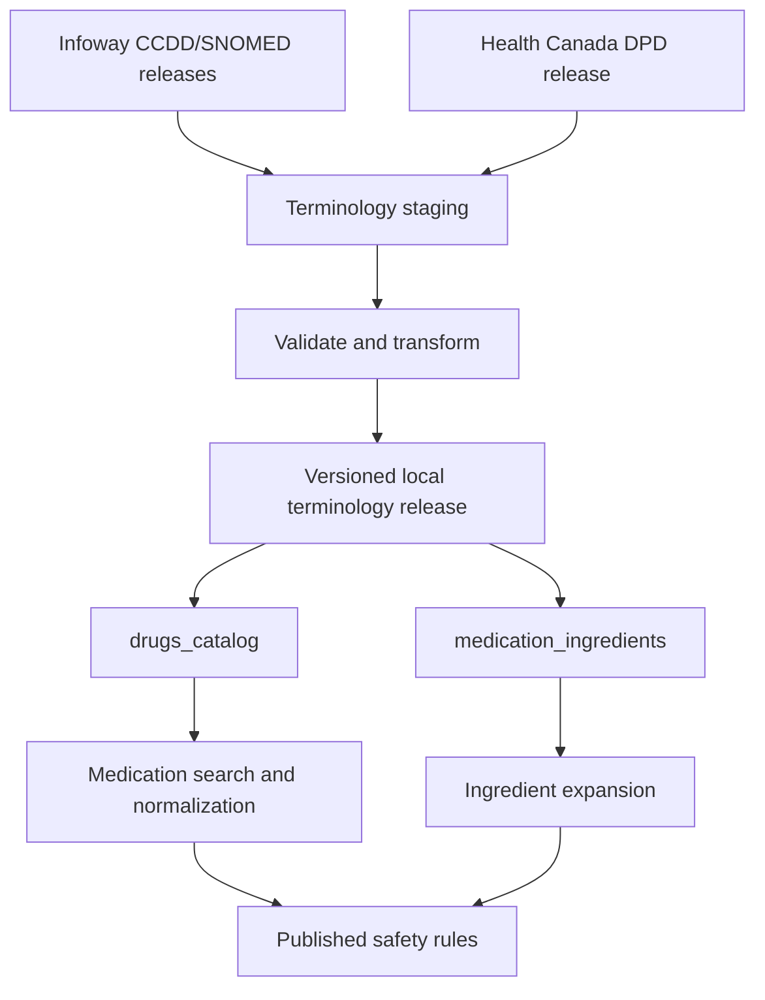

# SafeScribe Terminology-Managed Medication Datasets

## Cursor-Ready Developer Implementation Guide

**Version:** 1.0  
**Audience:** SafeScribe developer  
**Target stack:** Supabase/PostgreSQL, TypeScript, existing CCDD/SNOMED integration and SafeScribe Admin Portal  
**Datasets covered:** `drugs-catalog` and `medication-ingredients`

---

## 1. Outcome to build

Build two locally synchronized, versioned terminology datasets:

1. `drugs_catalog`: one row per normalized CCDD medication concept, enriched where available with SNOMED CT, ATC and Health Canada DPD/DIN data.
2. `medication_ingredients`: one row per medication-to-active-ingredient relationship derived from authoritative CCDD/SNOMED relationships.

These are database datasets and Admin views, not clinician-authored rule spreadsheets.

They must support:

- medication search and selection;
- brand, generic and synonym lookup;
- normalization of a selected product to a stable coded concept;
- resolution of every product to all active ingredients;
- direct ingredient-allergy matching;
- matching medication selectors in the 12 repository files;
- proposing members for governed clinical value sets;
- reproducible results pinned to terminology releases;
- safe terminology updates without silently changing the published clinical repository.

The central rule is:

> CCDD/SNOMED/DPD identify the medication and its ingredients. Published SafeScribe rules and value sets determine the clinical action.

Do not make the national terminology service a synchronous dependency of live prescribing. Synchronize and validate terminology into SafeScribe, then evaluate locally against a pinned release.

---

## 2. Source responsibilities

| Source | Use in SafeScribe | Do not use it for |
|---|---|---|
| CCDD | Primary Canadian medication identity; normalized names; medication concept types; strength/form/route attributes; medication relationships | Clinical alert severity or action |
| SNOMED CT CA | Substance/ingredient identifiers, medicinal-product hierarchy and relationship semantics where present | Automatically treating every ancestor as a clinically approved safety class |
| ATC | Classification metadata and candidate generation for value sets | Direct clinical rule matching without SafeScribe review |
| Health Canada DPD | DIN, brand/product, company, marketed/approved/dormant/cancelled status, product metadata and Canadian market enrichment | Primary semantic medication hierarchy |
| SafeScribe value sets | Clinically reviewed groups actually referenced by rules | Replacing CCDD product identity |

CCDD is available through Infoway's FHIR Terminology Server and syndication service. System-to-system API use requires a project system account. The legacy Terminology Gateway is no longer the current source for new CCDD/SNOMED releases; use the Terminology Server.

Health Canada DPD is a separate product database. Its bulk extract contains approved, marketed, cancelled and dormant product files and is designed to be loaded into a database.

---

## 3. Runtime architecture



Never run:

```text
patient request -> national terminology API -> safety result
```

Use:

```text
scheduled terminology sync -> local immutable release -> patient request -> local safety result
```

This avoids external latency/outages and preserves the exact terminology version used for each finding.

---

## 4. Prerequisites and access

Before writing import code:

1. Register for Infoway Accelerō access.
2. Request an Infoway system-to-system account for SafeScribe.
3. Obtain the production FHIR and syndication authentication details from Infoway.
4. Store credentials in the server secret manager. Never expose them in the browser, repository or logs.
5. Confirm the current canonical CCDD `CodeSystem.url`, resource identifiers, relationship properties, file format and release/version fields from the authenticated server.
6. Download one complete CCDD release and its release notes.
7. Obtain the corresponding SNOMED CT CA release if CCDD relationship processing requires it.
8. Download the current Health Canada DPD UTF-8 bulk extract and its official structure/readme.
9. Save source checksums, filenames, retrieval timestamps and release versions.

Do not invent a CCDD canonical URL or property code from examples. Discover these from the actual authenticated FHIR resources and release documentation and store them as configuration.

Suggested secrets:

```text
INFOWAY_TOKEN_URL
INFOWAY_CLIENT_ID
INFOWAY_CLIENT_SECRET
INFOWAY_FHIR_BASE_URL
INFOWAY_SYNDICATION_BASE_URL
```

Suggested non-secret configuration:

```text
CCDD_CODE_SYSTEM_CANONICAL_URL
SNOMED_SYSTEM_URI=http://snomed.info/sct
SNOMED_CA_EDITION_URI=http://snomed.info/sct/20611000087101
TERMINOLOGY_DEFAULT_LANGUAGE=en-CA
```

Store the full SNOMED release version in each terminology release record. The edition URI alone is not a release date.

---

## 5. Database design

Use snake_case SQL tables. The Admin labels may display `drugs-catalog` and `medication-ingredients`.

### 5.1 Terminology releases

```sql
create table terminology_releases (
  id uuid primary key default gen_random_uuid(),
  release_key text not null unique,
  status text not null check (status in (
    'DISCOVERED', 'DOWNLOADED', 'STAGED', 'VALIDATED',
    'READY', 'ACTIVE', 'FAILED', 'RETIRED'
  )),
  ccdd_version text not null,
  ccdd_canonical_url text not null,
  snomed_version text,
  dpd_release_date date,
  source_metadata jsonb not null default '{}'::jsonb,
  source_checksums jsonb not null default '{}'::jsonb,
  validation_summary jsonb not null default '{}'::jsonb,
  downloaded_at timestamptz,
  validated_at timestamptz,
  activated_at timestamptz,
  created_at timestamptz not null default now(),
  created_by uuid references auth.users(id)
);

create unique index uq_active_terminology_release
on terminology_releases ((status))
where status = 'ACTIVE';
```

Do not update an active release in place. Build a new release, validate it, activate it atomically, and retain the previous release for rollback and audit.

### 5.2 `drugs_catalog`

```sql
create table drugs_catalog (
  id uuid primary key default gen_random_uuid(),
  terminology_release_id uuid not null references terminology_releases(id),

  source_system text not null,
  source_code text not null,
  source_version text not null,
  concept_key text not null,

  concept_type text not null,
  preferred_name_en text not null,
  preferred_name_fr text,
  normalized_search_name text not null,
  synonyms jsonb not null default '[]'::jsonb,

  clinical_drug_code text,
  generic_product_code text,
  packaged_product_code text,
  snomed_code text,

  brand_name text,
  strength_numerator_value numeric,
  strength_numerator_unit text,
  strength_denominator_value numeric,
  strength_denominator_unit text,
  dose_form_code text,
  dose_form_display text,
  route_codes text[] not null default '{}',
  route_displays text[] not null default '{}',

  atc_codes text[] not null default '{}',
  din_codes text[] not null default '{}',
  dpd_drug_codes text[] not null default '{}',
  market_status text,
  manufacturer_names text[] not null default '{}',

  is_active boolean not null,
  effective_start date,
  effective_end date,
  replaced_by_source_code text,
  raw_source jsonb not null,
  created_at timestamptz not null default now(),

  unique (terminology_release_id, source_system, source_code)
);

create index idx_drugs_catalog_release_active
  on drugs_catalog (terminology_release_id, is_active);
create index idx_drugs_catalog_snomed
  on drugs_catalog (snomed_code) where snomed_code is not null;
create index idx_drugs_catalog_din
  on drugs_catalog using gin (din_codes);
create index idx_drugs_catalog_atc
  on drugs_catalog using gin (atc_codes);
```

`concept_key` must be deterministic, for example:

```text
ccdd|<canonical-url>|<source-code>
```

It is an internal business key, not a replacement for the original code/system/version.

Recommended `concept_type` controlled values:

```text
INGREDIENT
PRECISE_INGREDIENT
MEDICINAL_PRODUCT
CLINICAL_DRUG
BRANDED_CLINICAL_DRUG
PACKAGED_PRODUCT
MARKETED_PRODUCT
UNKNOWN
```

Map actual CCDD types to these internal values in one adapter. Preserve the original type in `raw_source` and optionally a `source_concept_type` column. Do not infer concept type from the display name.

### 5.3 Medication search terms

Do not depend on scanning JSON synonyms for every query.

```sql
create extension if not exists pg_trgm;

create table medication_search_terms (
  id uuid primary key default gen_random_uuid(),
  terminology_release_id uuid not null references terminology_releases(id),
  medication_id uuid not null references drugs_catalog(id) on delete cascade,
  term text not null,
  normalized_term text not null,
  language_code text not null default 'en-CA',
  term_type text not null,
  priority smallint not null default 100,
  unique (terminology_release_id, medication_id, normalized_term, term_type)
);

create index idx_medication_search_terms_trgm
on medication_search_terms using gin (normalized_term gin_trgm_ops);
```

Suggested `term_type` values: `PREFERRED`, `SYNONYM`, `BRAND`, `GENERIC`, `DIN`, `FORMATTED_DISPLAY`.

### 5.4 `medication_ingredients`

```sql
create table medication_ingredients (
  id uuid primary key default gen_random_uuid(),
  terminology_release_id uuid not null references terminology_releases(id),
  medication_id uuid not null references drugs_catalog(id),
  ingredient_id uuid not null references drugs_catalog(id),

  relationship_type text not null,
  source_relationship_code text,
  ingredient_role text not null default 'ACTIVE',
  basis_of_strength boolean,
  strength_numerator_value numeric,
  strength_numerator_unit text,
  strength_denominator_value numeric,
  strength_denominator_unit text,
  relationship_group integer,

  provenance_source text not null,
  provenance_version text not null,
  derivation_method text not null,
  is_active boolean not null default true,
  raw_source jsonb not null,
  created_at timestamptz not null default now(),

  unique (
    terminology_release_id,
    medication_id,
    ingredient_id,
    relationship_type,
    ingredient_role
  ),
  check (medication_id <> ingredient_id)
);

create index idx_medication_ingredients_medication
  on medication_ingredients (terminology_release_id, medication_id)
  where is_active;
create index idx_medication_ingredients_ingredient
  on medication_ingredients (terminology_release_id, ingredient_id)
  where is_active;
```

Use controlled `relationship_type` values such as:

```text
HAS_ACTIVE_INGREDIENT
HAS_PRECISE_ACTIVE_INGREDIENT
HAS_BASIS_OF_STRENGTH_SUBSTANCE
DERIVED_TRANSITIVE_INGREDIENT
```

Only direct authoritative CCDD/SNOMED relationships should normally populate the first three. If a transitive relationship is generated, label it clearly and retain the complete derivation path in `raw_source`.

Do not include inactive ingredients/excipients in the direct-allergy matching table unless SafeScribe later creates a separate, clinically governed excipient-allergy feature.

### 5.5 DPD crosswalk

DPD is often many-to-many relative to normalized clinical concepts. Keep its product records separately and then crosswalk them.

```sql
create table dpd_products (
  id uuid primary key default gen_random_uuid(),
  terminology_release_id uuid not null references terminology_releases(id),
  drug_code text not null,
  din text,
  brand_name text,
  class_name text,
  drug_identification_number_status text,
  company_name text,
  dosage_form jsonb,
  route jsonb,
  active_ingredients jsonb,
  atc_codes jsonb,
  source_status text not null,
  raw_source jsonb not null,
  unique (terminology_release_id, drug_code, source_status)
);

create table medication_dpd_crosswalk (
  id uuid primary key default gen_random_uuid(),
  terminology_release_id uuid not null references terminology_releases(id),
  medication_id uuid not null references drugs_catalog(id),
  dpd_product_id uuid not null references dpd_products(id),
  match_method text not null,
  match_confidence numeric(5,4),
  review_status text not null,
  reviewed_by uuid references auth.users(id),
  reviewed_at timestamptz,
  unique (terminology_release_id, medication_id, dpd_product_id)
);
```

Prefer an authoritative CCDD-to-DPD/DIN link when CCDD supplies it. Only use normalized name/ingredient/form/strength matching as a fallback proposal requiring validation; never silently publish fuzzy matches.

---

## 6. How to obtain and ingest CCDD/SNOMED data

Implement a source adapter so the rest of the application does not depend on one file layout.

```ts
export interface TerminologySourceAdapter {
  discoverLatestRelease(): Promise<ReleaseDescriptor>;
  downloadRelease(release: ReleaseDescriptor): Promise<DownloadedArtifact[]>;
  verifyArtifacts(artifacts: DownloadedArtifact[]): Promise<void>;
  streamConcepts(artifacts: DownloadedArtifact[]): AsyncIterable<SourceConcept>;
  streamRelationships(artifacts: DownloadedArtifact[]): AsyncIterable<SourceRelationship>;
}
```

### Preferred production approach: release syndication

1. Poll Infoway's public CCDD syndication feed for release metadata.
2. Compare the discovered version and artifact identifier with `terminology_releases`.
3. If already downloaded and checksums match, stop idempotently.
4. Exchange the system credentials for an authorization token using the process supplied by Infoway.
5. Download the selected CCDD artifact to private temporary storage.
6. Verify HTTP status, content type, file size and checksum.
7. Quarantine any changed artifact that reuses a previously seen release identifier.
8. Parse the release into staging tables.
9. Import the corresponding SNOMED CT CA artifact only if required for relationship/hierarchy processing.
10. Preserve every source resource/row in `raw_source` or immutable object storage for audit.

### FHIR API approach

FHIR may be used for discovery, targeted validation, `$lookup`, `$validate-code`, `$expand` and controlled retrieval. Use the exact canonical URLs and supported parameters found in the authenticated server.

Typical operation shapes—not hard-coded CCDD identifiers—are:

```http
GET {FHIR_BASE}/CodeSystem?url={CCDD_CANONICAL_URL}&_elements=id,url,version,status&_sort=-version&_count=20
GET {FHIR_BASE}/CodeSystem/$lookup?system={CCDD_CANONICAL_URL}&code={CODE}&property=*
GET {FHIR_BASE}/ValueSet/$expand?url={VALUE_SET_URL}&count={PAGE_SIZE}&offset={OFFSET}
POST {FHIR_BASE}/CodeSystem/$validate-code
```

Requirements:

- send `Accept: application/fhir+json`;
- use server-side OAuth credentials only;
- implement token refresh, timeout and bounded exponential backoff;
- respect `Bundle.link[next]`, pagination and rate limits;
- cache validation responses;
- log request IDs and resource versions, never tokens;
- do not assume `CodeSystem/$lookup` returns every relationship needed for bulk construction;
- use release artifacts for full ingestion when available.

### Parsing concepts

For each CCDD concept:

1. read `system`, `code`, `version`, status and designation data;
2. store English and French preferred terms separately;
3. store synonyms/designations in `medication_search_terms`;
4. map the source concept kind to SafeScribe `concept_type`;
5. map structured strength, form and route attributes without parsing the preferred term;
6. retain ATC, DIN/DPD and replacement/history properties where supplied;
7. mark inactive concepts but never delete them;
8. retain the unmodified source representation.

If the source supplies an attribute in both structured and display-text form, structured data is authoritative. Display text is a snapshot for users.

### Parsing ingredient relationships

For each medication concept:

1. collect the authoritative relationship properties that mean active ingredient, precise active ingredient and/or basis-of-strength substance;
2. resolve each relationship target to a concept in the same staged release;
3. verify that the target is an ingredient/substance concept type;
4. create one `medication_ingredients` row per target;
5. preserve relationship grouping and strength data where available;
6. record provenance source, source version and relationship code;
7. reject orphan relationship targets;
8. flag a clinical drug or marketed product with zero resolved active ingredients;
9. allow multiple active ingredient rows for combination products;
10. deduplicate only identical coded relationships, never distinct ingredient targets.

Example expected result:

```text
Clavulin product concept
  -> HAS_ACTIVE_INGREDIENT -> amoxicillin ingredient concept
  -> HAS_ACTIVE_INGREDIENT -> clavulanic acid ingredient concept
```

Do not derive this by splitting `amoxicillin/clavulanate` text.

---

## 7. Health Canada DPD ingestion

Use the UTF-8 bulk extract for scheduled synchronization. The public DPD API may be useful for targeted checks, but a bulk release is preferable for a reproducible local catalogue.

For each DPD release:

1. download the official readme/structure and required zip files;
2. ingest marketed, approved, dormant and cancelled sources into staging with a `source_status` field;
3. join files using the official DPD keys, especially `DRUG_CODE`; do not infer joins from names;
4. normalize DIN as text so leading zeroes are preserved;
5. retain products that are no longer marketed for historical medication reconciliation;
6. make current marketed products rank higher in medication search;
7. load active ingredient, route, form, company, status and ATC data;
8. create crosswalk proposals to CCDD concepts;
9. automatically accept only authoritative identifiers or deterministic exact mappings approved by the mapping policy;
10. route ambiguous mappings to Admin review.

Do not overwrite CCDD route/form/strength semantics with DPD text. Store provenance and choose a declared precedence for every field.

Suggested precedence:

```text
identity and clinical semantics: CCDD/SNOMED
Canadian product/DIN/market status: DPD
classification metadata: CCDD-enriched ATC, otherwise DPD ATC
display/search aliases: merge with provenance
```

---

## 8. Staging and release pipeline

Create staging tables that mirror the raw source structures. Do not write downloaded rows directly to active production tables.

```text
DISCOVERED
  -> DOWNLOADED
  -> STAGED
  -> VALIDATED
  -> READY
  -> ACTIVE
```

Each transition must be idempotent and transactionally recorded.

### Required validation gates

Block activation when any of these occur:

- duplicate `(system, code, version)` concepts;
- missing release version or canonical source URL;
- orphan ingredient relationship;
- active clinical drug/product with no resolved ingredient;
- ingredient relationship pointing to a non-ingredient concept without an approved mapping;
- malformed DIN or duplicate conflicting DPD product key;
- unresolved authoritative CCDD-to-DPD identifier;
- unexpected concept-count collapse or increase beyond configured thresholds;
- combination-product ingredient count unexpectedly reduced;
- route/form/strength parsing failure above threshold;
- failed allergy regression cases;
- failed value-set membership impact review.

Warnings requiring review:

- preferred display changed while the code remained stable;
- concept became inactive or gained a replacement;
- ingredient relationship changed;
- ATC assignment changed;
- DPD market status changed;
- previously mapped product became ambiguous.

### Release diff

Generate and store:

```ts
type TerminologyDiff = {
  conceptsAdded: string[];
  conceptsInactivated: string[];
  conceptsReactivated: string[];
  displaysChanged: string[];
  ingredientEdgesAdded: string[];
  ingredientEdgesRemoved: string[];
  atcChanges: string[];
  dinStatusChanges: string[];
  affectedPublishedValueSets: string[];
  affectedPublishedRules: string[];
};
```

Never automatically modify a published SafeScribe value-set version because the terminology hierarchy changed. Generate candidate membership changes, require review, and publish a new value-set/repository release.

### Atomic activation

Activate only after validation and regression tests:

```sql
begin;

update terminology_releases
set status = 'RETIRED'
where status = 'ACTIVE';

update terminology_releases
set status = 'ACTIVE', activated_at = now()
where id = :new_release_id and status = 'READY';

commit;
```

Use an advisory lock so two synchronization jobs cannot activate concurrently.

---

## 9. Medication search and selection

The frontend must store the selected coded medication, not only its display string.

Return:

```ts
type MedicationSearchResult = {
  medicationId: string;
  system: string;
  code: string;
  version: string;
  display: string;
  conceptType: string;
  brandName?: string;
  strengthDisplay?: string;
  doseFormDisplay?: string;
  routeDisplays: string[];
  dins: string[];
  marketStatus?: string;
  activeIngredientSummary: string[];
};
```

Ranking order:

1. exact DIN;
2. exact normalized preferred/brand name;
3. prefix match;
4. synonym match;
5. trigram/fuzzy match above a conservative threshold.

Then rank current marketed products and clinically selectable concept types above inactive/historical concepts. Never hide inactive concepts when reviewing historical medication records.

Search endpoint:

```http
GET /api/terminology/medications/search?q=clavulin&route=oral&limit=20
```

Response must include `terminologyReleaseId`. When a consultation begins, pin that release for the complete evaluation.

---

## 10. Ingredient resolution service

Create one server-side service used by allergy, DDI and rule-selector matching.

```ts
type ResolvedIngredient = {
  ingredientId: string;
  system: string;
  code: string;
  version: string;
  display: string;
  relationshipType: string;
  derivationMethod: string;
};

async function resolveActiveIngredients(
  medicationId: string,
  terminologyReleaseId: string,
): Promise<ResolvedIngredient[]>;
```

Rules:

- query only the pinned terminology release;
- return all unique active/precise active ingredients;
- do not return ATC classes as ingredients;
- do not perform free-text parsing as a fallback;
- fail closed to an explicit `TERMINOLOGY_INCOMPLETE` result if an expected relationship is missing;
- cache by `(terminology_release_id, medication_id)`;
- include provenance in diagnostics.

For an ingredient concept selected directly, the normalizer may return that concept itself as the resolved ingredient. Implement this explicitly; do not create a self-edge in `medication_ingredients`.

---

## 11. Direct allergy integration

Direct allergy is deterministic ingredient intersection, not an authored row per ingredient.

```ts
const selectedIngredients = await resolveActiveIngredients(
  selectedMedicationId,
  terminologyReleaseId,
);

const normalizedAllergens = await normalizeAllergyRecords(
  patientAllergies,
  terminologyReleaseId,
);

const matches = intersectByCanonicalIngredient(
  selectedIngredients,
  normalizedAllergens,
);
```

Required flow:

```text
Recorded allergy: amoxicillin
Selected product: Clavulin
Clavulin ingredients: amoxicillin + clavulanic acid
Exact canonical ingredient intersection: amoxicillin
Finding: direct ingredient allergy
```

Normalize salt/precise-ingredient variants through authoritative relationships. Do not assume two concepts are equivalent because their strings share a word.

Keep alert severity, intolerance handling, unknown reaction handling, acknowledgement, override and wording in a small versioned `allergy_direct_policy`. Keep cross-reactivity in `allergy_cross_reactivity_rules`.

---

## 12. Integration with the 12 repository files

### Medication selectors

Rule selectors must resolve to one of:

```text
MEDICATION_CONCEPT
INGREDIENT_SELECTOR
VALUE_SET
```

At import time:

- resolve `MEDICATION_CONCEPT` and `INGREDIENT_SELECTOR` to local terminology IDs;
- verify source system, code and version;
- preserve the workbook display name only as a review snapshot;
- reject ambiguous or unresolved selectors;
- never use names as runtime keys.

At runtime:

1. load selected medication concept;
2. expand its active ingredients;
3. load published value-set membership pinned to the repository release;
4. evaluate exact medication, exact ingredient and approved value-set selectors;
5. apply route/form/indication and other rule qualifiers;
6. consolidate/deduplicate findings.

### Clinical value-set proposals

Terminology may propose value-set members using:

- ATC codes;
- SNOMED hierarchy/ECL expansion;
- CCDD concept relationships;
- route, dosage form and active status.

Store proposals separately from published membership:

```sql
create table value_set_member_candidates (
  id uuid primary key default gen_random_uuid(),
  value_set_version_id uuid not null,
  terminology_release_id uuid not null references terminology_releases(id),
  medication_id uuid not null references drugs_catalog(id),
  proposal_method text not null,
  proposal_expression text,
  status text not null default 'PROPOSED',
  rationale jsonb not null,
  unique (value_set_version_id, terminology_release_id, medication_id)
);
```

Only approved `clinical_value_set_members` affect live matching. A terminology update must not silently add a new NSAID, corticosteroid or retinoid to an already published SafeScribe value set.

---

## 13. Admin Portal

Under `Repository > Reference data`, create:

### Drug Catalogue

Read-only terminology-managed grid with:

- preferred name;
- concept type;
- source system/code/version;
- brand/generic name;
- strength, form and route;
- active ingredients;
- ATC;
- DIN and market status;
- active/inactive status;
- release version;
- source/provenance drawer.

Actions:

- search and filter;
- inspect relationships;
- view previous version/diff;
- report a terminology issue;
- export a filtered snapshot for analysis.

Do not provide routine `Add`, `Edit` or spreadsheet upload actions for authoritative fields.

### Medication Ingredients

Read-only relationship grid with:

- medication name/code;
- ingredient name/code;
- relationship type;
- strength/basis-of-strength data;
- provenance;
- terminology release;
- active status.

Include a combination-product inspection panel so the reviewer can confirm every expected ingredient.

### Terminology Updates

Create an operational page showing:

- active release;
- available release;
- download/staging/validation status;
- concept and relationship counts;
- additions/inactivations;
- ingredient changes;
- affected value sets/rules/tests;
- unresolved DPD mappings;
- activation and rollback controls;
- full audit history.

Only authorized technical administrators may run synchronization. Only an approved release can be activated.

---

## 14. APIs

Suggested server endpoints:

```text
GET  /api/terminology/releases/active
GET  /api/terminology/medications/search
GET  /api/terminology/medications/:id
GET  /api/terminology/medications/:id/ingredients
GET  /api/admin/terminology/releases
POST /api/admin/terminology/releases/discover
POST /api/admin/terminology/releases/:id/download
POST /api/admin/terminology/releases/:id/stage
POST /api/admin/terminology/releases/:id/validate
POST /api/admin/terminology/releases/:id/activate
POST /api/admin/terminology/releases/:id/rollback
GET  /api/admin/terminology/releases/:id/diff
```

Do not allow the client to specify an arbitrary active release. The server resolves the current release or uses the consultation's already pinned release.

---

## 15. Security, audit and RLS

- Service-role-only write access to terminology tables.
- Authenticated application users receive read access only to the active release and permitted historical records.
- Clinical repository importers may resolve terminology but may not modify it.
- Every synchronization action writes an audit event with actor, release, timestamp, counts and result.
- Never log source credentials or authorization headers.
- Treat downloaded artifacts as supply-chain inputs: validate source, HTTPS, checksum, file type and decompression limits.
- Prevent zip-slip paths and decompression bombs.
- Use parameterized SQL and bounded bulk inserts.
- Keep the raw artifacts private; expose only normalized records through the application API.

---

## 16. Required tests

### Unit tests

- concept-type mapping;
- bilingual designation mapping;
- structured strength/form/route parsing;
- DIN preservation as text;
- one-, two- and three-ingredient products;
- duplicate relationship removal;
- ingredient concept selected directly;
- inactive/replaced concepts;
- search normalization and ranking;
- release pinning.

### Integration tests

- syndication discovery is idempotent;
- failed checksum cannot stage;
- orphan ingredient blocks validation;
- zero-ingredient clinical product blocks validation;
- DPD joins use official keys;
- activation is atomic;
- rollback restores the previous release;
- active consultations continue using their pinned release;
- published value-set members do not change after terminology activation;
- repository rule selectors resolve correctly.

### Mandatory clinical regression cases

1. Amoxicillin allergy + amoxicillin product -> direct allergy finding.
2. Amoxicillin allergy + amoxicillin/clavulanate product -> direct allergy finding.
3. Clavulanic-acid allergy + amoxicillin/clavulanate product -> direct allergy finding.
4. Amoxicillin allergy + unrelated medication -> no direct match.
5. Combination product -> all ingredients returned once.
6. Topical diclofenac is not automatically treated as a systemic NSAID value-set member.
7. Inactive historical DIN remains resolvable for medication history.
8. New terminology concept creates a candidate value-set member, not a live member.
9. Missing ingredient relationship returns `TERMINOLOGY_INCOMPLETE`, not a false safe result.
10. Terminology release change is traceable on every safety evaluation.

---

## 17. Implementation order

Complete in this sequence:

1. Create migrations for releases, raw/staging, catalogue, search terms, ingredients and DPD crosswalks.
2. Add source configuration and secrets.
3. Implement Infoway token handling and syndication discovery.
4. Implement artifact download/checksum/quarantine.
5. Implement CCDD concept adapter.
6. Implement CCDD/SNOMED ingredient relationship adapter.
7. Implement DPD bulk loader and deterministic crosswalk.
8. Implement validation and release diff.
9. Load a non-production terminology release.
10. Verify representative single-ingredient and combination products manually.
11. Implement search and ingredient-resolution APIs.
12. Integrate coded medication selection into Prescribe/Renew.
13. Implement generic direct-allergy intersection.
14. Resolve repository workbook selectors to terminology IDs.
15. Add value-set candidate generation without auto-publication.
16. Build Admin reference-data and update pages.
17. Run the 12-file test suite plus terminology regression tests.
18. Activate only after clinical and technical sign-off.

---

## 18. Cursor prompts

Use one prompt at a time. Require Cursor to inspect existing project conventions before changing files.

### Prompt 1 — inspect and plan

```text
Inspect the SafeScribe repository and identify the existing Supabase migrations,
server API pattern, authentication/RLS conventions, medication search code,
CCDD/SNOMED integration, clinical repository tables and test framework.

Do not modify files. Return:
1. relevant paths;
2. existing reusable types/services;
3. conflicts with the terminology guide;
4. a file-by-file implementation plan;
5. unknown CCDD canonical URLs or property codes that must be discovered rather
   than guessed.
```

### Prompt 2 — migrations

```text
Implement versioned PostgreSQL/Supabase migrations for terminology_releases,
drugs_catalog, medication_search_terms, medication_ingredients, dpd_products,
medication_dpd_crosswalk and required staging/audit tables.

Requirements:
- preserve code + system + version;
- immutable releases;
- service-role-only writes;
- active-release read policy;
- indexes for name, DIN, ATC, medication-to-ingredient and ingredient-to-medication;
- rollback migration or documented rollback;
- no display-name foreign keys.

Add database tests for uniqueness, release isolation and RLS.
```

### Prompt 3 — source clients

```text
Implement server-only Infoway terminology source clients using environment
configuration. Add OAuth token caching/refresh, CCDD syndication discovery,
artifact download, checksum verification, timeout, bounded retry and structured
errors.

Do not hard-code or invent a CCDD canonical URL, OAuth endpoint or relationship
property. Read them from environment/configuration and add a discovery command
that reports authenticated FHIR CodeSystem metadata for administrator approval.
Never expose credentials to frontend code or logs.
```

### Prompt 4 — CCDD transformation

```text
Implement a streaming CCDD adapter that transforms one downloaded release into
staging concepts and relationships. Preserve raw source records and provenance.
Map concept identity, bilingual designations, concept type, structured strength,
form, route, ATC, DIN/DPD links, active status and replacement history.

Implement relationship extraction for active ingredient, precise active
ingredient and basis-of-strength substance using configured authoritative
property codes. Reject orphan targets and never derive ingredients by parsing
medication names.

Add fixtures for single-ingredient and combination products.
```

### Prompt 5 — DPD ingestion

```text
Implement a streaming loader for the official Health Canada DPD UTF-8 bulk
extract. Use the official readme field order and official DRUG_CODE joins.
Preserve DIN as text, source status, active ingredients, route, form, company and
ATC data. Build CCDD crosswalk proposals, accepting only authoritative or
approved deterministic matches. Fuzzy matches must remain pending review.

Add malformed-file, duplicate-key, leading-zero DIN and historical-status tests.
```

### Prompt 6 — validation and activation

```text
Implement terminology release validation, diffing and atomic activation.
Block orphan ingredients, missing ingredients on selectable products, duplicate
codes, invalid DPD keys, severe count changes and failed regression tests.
Report concept, ingredient-edge, ATC, DIN/status, affected-value-set and
affected-rule changes. Use a PostgreSQL advisory lock and retain rollback to the
previous immutable release.
```

### Prompt 7 — runtime services

```text
Implement medication search and resolveActiveIngredients services against a
pinned local terminology release. Search must support exact DIN, preferred,
brand, synonym, prefix and conservative trigram matching. Return coded concepts
and ingredient summaries. Never use an external terminology call in the live
safety request and never use text parsing as an ingredient fallback.

Add caching keyed by terminology_release_id and medication_id.
```

### Prompt 8 — safety integration

```text
Integrate drugs_catalog and medication_ingredients with the deterministic
SafeScribe safety engine. Implement direct ingredient-allergy intersection,
including combination products. Resolve repository selectors as exact medication,
exact ingredient or published value set. Keep allergy cross-reactivity authored
rules separate. If expected terminology is incomplete, return a visible
TERMINOLOGY_INCOMPLETE finding and do not report a false safe result.

Add the ten mandatory clinical regression tests from the guide.
```

### Prompt 9 — Admin UI

```text
Add Repository > Reference data pages for Drug Catalogue and Medication
Ingredients and a Terminology Updates operational page. The two reference tables
are read-only and terminology-managed. Show source code/version, ingredients,
form, route, ATC, DIN/status, provenance and release. Add diff, validation,
activation and rollback workflows with role checks and audit history.

Do not add manual spreadsheet upload or ordinary edit buttons for authoritative
terminology rows.
```

---

## 19. Definition of done

- [ ] Current CCDD canonical URL and supported relationship properties are discovered from the authenticated production service and documented.
- [ ] Source credentials are server-only.
- [ ] CCDD and DPD releases are downloaded reproducibly with checksums.
- [ ] Every catalogue row preserves code, system and version.
- [ ] Every selectable clinical drug/product resolves to at least one active ingredient.
- [ ] Combination products resolve to every active ingredient.
- [ ] No ingredient is derived only from text parsing.
- [ ] DPD enrichment preserves DIN and market status without replacing CCDD identity.
- [ ] Search stores coded selections, not names alone.
- [ ] Direct allergy uses canonical ingredient intersection.
- [ ] Published SafeScribe value sets do not change automatically after terminology updates.
- [ ] Rule workbook selectors resolve to terminology IDs before approval.
- [ ] Live evaluation uses a local pinned release and makes no required external terminology call.
- [ ] Update validation, diff, activation and rollback are implemented.
- [ ] Admin reference-data pages are read-only.
- [ ] All terminology and clinical regression tests pass.
- [ ] Every safety finding records terminology and repository release IDs.

---

## 20. Official implementation references

- [Canada Health Infoway Terminology Server](https://accelero.infoway-inforoute.ca/en/tools/standards-tools/terminology-server)
- [Canada Health Infoway terminology syndication feeds](https://infocentral.infoway-inforoute.ca/en/syndication-feed)
- [CCDD availability in the FHIR Terminology Server](https://infocentral.infoway-inforoute.ca/en/news-events/infocentral-news/4107-canadian-clinical-drug-data-set-ccdd-now-available-in-the-terminology-server)
- [Health Canada DPD bulk data extract](https://www.canada.ca/en/health-canada/services/drugs-health-products/drug-products/drug-product-database/what-data-extract-drug-product-database.html)
- [Health Canada DPD API documentation](https://health-products.canada.ca/api/documentation/dpd-documentation-en.html)

The authenticated Infoway user guide, CCDD technical specification, current release notes and actual FHIR resource metadata are authoritative for endpoint-specific parameters and CCDD property codes. Where they differ from this architecture guide, update the source adapter—not the clinical repository model.
